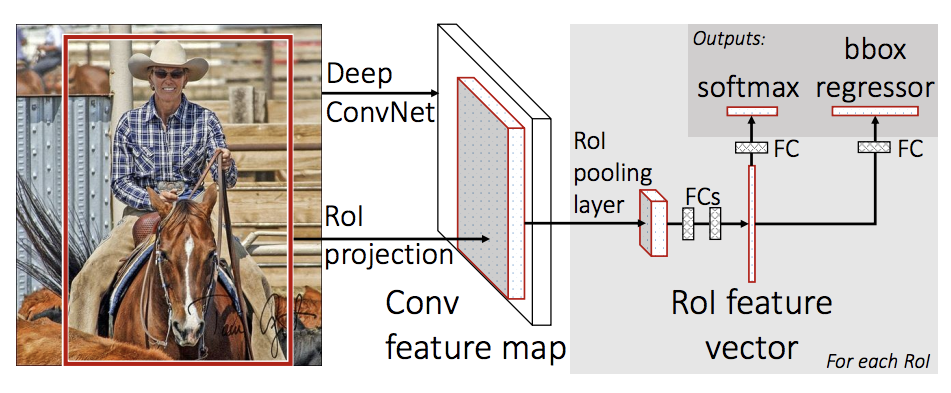

# Fine Tuning Faster-RCNN

This code is based on [Torchvision Object Detection Tutorial](https://pytorch.org/tutorials/intermediate/torchvision_tutorial.html) and [PyTorch YoloV3](https://github.com/eriklindernoren/PyTorch-YOLOv3) and implements FasterRCNN for training and inference in custom datasets.

Original paper: [Faster R-CNN: Towards Real-Time Object Detection with Region Proposal  Networks](https://arxiv.org/pdf/1506.01497)



# Installation
Requirements:
* PyTorch
* Matplotlib
* OpenCV
* Pycocotools
* Numpy
* Imgaug

To be able to use the package as a module, make sure you change the line in `train.py`.
```
os.chdir('your_root_dir')
```

# Dataset format
There must be 4 txt files that point to your training and validation data.

* Train images (txt): Paths to all train images
* Val images (txt): Paths to all validation images
* Train labels (txt): Paths to all train labels
* Val labels (txt): Paths to all validation labels

The label files must be text files with the format:
```
1 0.714455 0.708194 0.341238 0.583612
class_id center_x center_y box_width box_height
```

* `class_id`: **One** indexed label for the class (no background label)
* `center_x`, `center_y`: Center position of bounding box in [0,1] scale
* `width`, `height`: Size of the bounding box in [0,1] scale

# Training
To train the network run
```
python3 -m FasterRCNN.model.train --train 1 --img_train "path to Train images (txt)" --img_val "path to Val images (txt)" --labels_train "path to Train labels (txt)" --labels_val "path to Val labels (txt)" --num_classes N --save_path "Saving directory for the model"
```

# Inference
To check the results run
```
python3 -m FasterRCNN.model.train --test_on_image "path to  image" --model_path "path to model" --num_classes N 
```